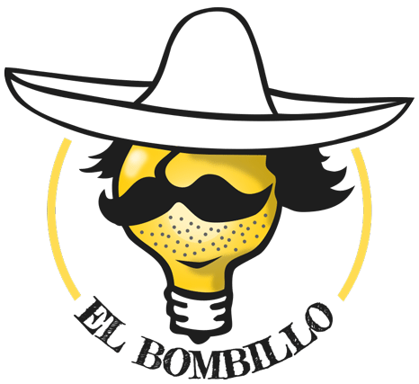

# Hola hombres!

We :heart: to innovate. And as much as we love to innovate, we're missing a simple, easy to use platform where we can share our ideas and improve our concept together. Moreover, we would like to know how brilliant our ideas are. For example I don't like :green_apple:s, but that doesn't mean that there isn't a _1.000.000$_ market for apples. Maybe apples are brilliant, who knows... (_I know for sure, but psst_ :smile: Refer to _Contributors constitution_ and feel free to convince me of the opposite).

So we created the idea of...

  

<i>The muchacho we trust!</i>

Maybe you're asking yourself who's _we_ and why are we doing this? We're just some enthusiastic software developpers and we as a group decided to explore the benefits and proper use of _Microservices_ and _Continuous delivery_. We'll achieve our goal together and we need a greenfield project we can play around with. That'll be _El Bombillo_.

## List of possible features

Here's a list of features this service may or may not include. For now it's an overview that will help you to get a better impression of what we'll be trying to do.

* Share ideas and define it by a title, teaser and longer description
* Search for ideas and see if they already exist
* Form a team, participate or search for contributors who might help in developing your idea
* We're gamers and we need _Gamification_. We feel naked without at least a few badges
* Share documents
* Add external links (e.g. contact, link to code repo)
* Organize your idea by a desired feature set
* Publish the status and progress of your idea (from _just thought about it_ to _here it is_)
* Blog about the progress
* Communicate, invite people to contribute
* Every user needs a profile page (where else should we put those badges?)
* Our ideas should be creditted by the community
* We need a calendar to appoint our meetings (... and we love :beer:, maybe it can be combined)
* Upload images (and other files) to illustrate our ideas
* We would like to discover ideas (best ideas, latest ideas, trending ideas, etc.)

## Next steps

* Answer [awkward questions for those boarding the microservices bandwagon](http://blog.oshineye.com/2015/01/awkward-microservices-questions.html) (e.g. [here](http://blog.jayfields.com/2015/03/my-answers-for-microservices-awkward.html))
* Discuss on technologies we like to use for for the build system (e.g. Gradle, Maven, Grunt, [itBldz](https://github.com/1and1/itBldz)), on how we want to setup our services (e.g. Docker, VMs, ...), on how we want to build or test them (e.g. Jenkins, [GoCD](http://www.go.cd/), TravisCI) and how we want to deploy them (e.g. Ansible, Puppet, Fabric, Salt, ...)

## How we work

* Communicate via [Gitter](https://gitter.im/bitionaire/el-bombillo) to get in contact or talk about your current task
* Upcoming and current tasks are located transparently in [Issues](https://github.com/bitionaire/el-bombillo/issues)
* We will post regular updates in our [Developers diary](https://github.com/bitionaire/el-bombillo/wiki/Developers-diary) so that you can follow our progress

## Contributors constitution

* Greet everybody on this project with either a casual _Hola!_ or _Buenos dias!_ /_Buenas tardes!_ / _Buenas noches!_, depending on the time of day
* We're open minded! We love to experiment and we love to fail, as we learn from our mistakes  and improve our skills everytime. Therefore we embrace controversy and are always up for a discussion.
* If you like to address one of your fellas, then call him _Hombre_ (_unisex_ in this case). **But**, take care of the proper use of this title and always be positive about it... _Always!_ Here some examples for the proper usage of _hombre_:

:white_check_mark: **Good**  | :x: **Bad**
---------------------------- | -----------
_Hombre, thats awesome! Let me show you how it get's even better!_ | _Hombre, that's bad. That's.. just bad._ :unamused:

* We like to honor our hombres in the **[Hall of Hombres](HALLOFHOMBRES.md)**. Every hombre who's done the most outstanding job for the past month will be honored and inducted ceremonically (by a simple commit) into the Hall of Hombres.
* We drink _Tequila_ every time we achieve a milestone! :cocktail:
* Stay positive and code with a smile. You should have as much as fun [as this guy](https://www.youtube.com/watch?v=KHZ8ek-6ccc) or otherwise invite some hombres for a coding _fiesta_!
